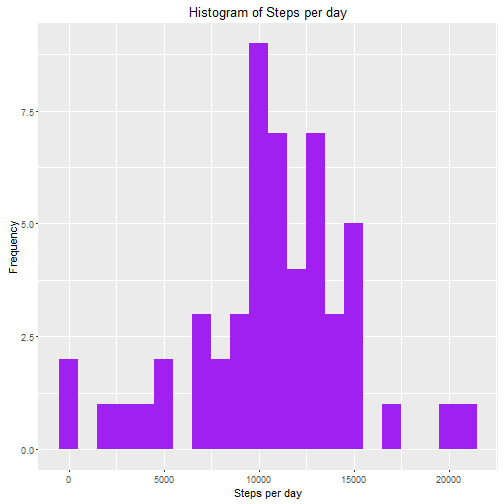
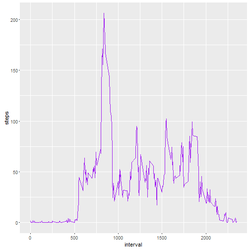
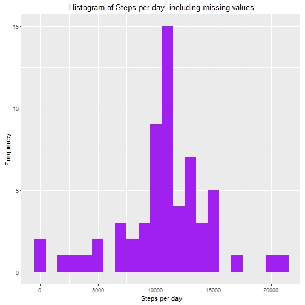
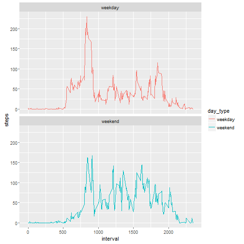

# Project Assignment 1 - Reproducible Research
### Oltjona Dyrmishi
April, 2016

Introduction
This assignment makes use of data from a personal activity monitoring device. This device collects data at 5 minute intervals throughout the day. The data consists of two months of data from an anonymous individual collected during the months of October and November, 2012 and include the number of steps taken in 5 minute intervals each day.

This document presents the results from Project Assignment 1 in the Coursera course Reproducible Research, written in a single R markdown document that can be processed by knitr and transformed into an HTML file.

## Prepare markdown environemnt

```r
library(knitr)
opts_chunk$set(echo = TRUE)
```

## Loading necessary libraries

```r
library(dplyr)
library(lubridate)
library(ggplot2)
```

## Precondition
Download [activity.zip] (https://d396qusza40orc.cloudfront.net/repdata%2Fdata%2Factivity.zip) file and unzip the activity.csv file in the ./data directory under your working directory.

# Loading and preprocessing the data


```r
# 1.  Read activity.csv file into activityData variable
activityData <- read.csv("./data/activity.csv", header = TRUE, sep = ',', colClasses = c("numeric", "character",
                                                                                         "integer"))
```

## What is mean total number of steps taken per day?
For this part of the assignment the missing values can be ignored.

*1. Calculate the total number of steps taken per day.*  
*2. Make a histogram of the total number of steps taken each day.*  
*3. Calculate and report the mean and median of the total number of steps taken per day.*  
*4. Calculate the total number of steps taken per day*  

- Calculate the total number of steps taken per day  


```r
TotalStepsPerDay <- activityData %>%
  filter(!is.na(steps)) %>%
  group_by(date) %>%
  summarize(steps = sum(steps)) %>%
  print
```

```
## Source: local data frame [53 x 2]
## 
##          date steps
##         (chr) (dbl)
## 1  2012-10-02   126
## 2  2012-10-03 11352
## 3  2012-10-04 12116
## 4  2012-10-05 13294
## 5  2012-10-06 15420
## 6  2012-10-07 11015
## 7  2012-10-09 12811
## 8  2012-10-10  9900
## 9  2012-10-11 10304
## 10 2012-10-12 17382
## ..        ...   ...
```

- Ploting the bar graph for total steps per day, using <font color='red'> ggplot </font>.   


```r
g <- ggplot(TotalStepsPerDay, aes(x = steps)) +
  geom_histogram(fill = "purple", binwidth = 1000) +
  labs(title = "Histogram of Steps per day", x = "Steps per day", y = "Frequency")

print(g)
```



- Calculate and report the mean and median of the total number of steps taken per day.  


```r
mean_steps <- mean(TotalStepsPerDay$steps, na.rm = TRUE)
median_steps <- median(TotalStepsPerDay$steps, na.rm = TRUE)

mean_steps
```

```
## [1] 10766.19
```

```r
median_steps
```

```
## [1] 10765
```

*Mean steps are 10766 and median steps are 10765.*  

## What is the average daily activity pattern?

*1. Make a time series plot (i.e. type = "l") of the 5-minute interval (x-axis) and the average number of steps taken, averaged across all days (y-axis)*  
*2. Which 5-minute interval, on average across all the days in the dataset, contains the maximum number of steps?*  

 
- Calculate average steps taken in each 5-minute interval per day using <font color='red'> dplyr </font> and group by interval  


```r
dailyAverageSteps <- activityData %>%
  filter(!is.na(steps)) %>%
  group_by(interval) %>%
  summarize(steps = mean(steps))
```

- Use <font color='red'> ggplot </font> for making the time series of the 5-minute interval and average steps taken:  


```r
g <- ggplot(dailyAverageSteps, aes(x=interval, y=steps)) +
  geom_line(color = "purple")

print(g)
```



- Use <font color='red'> which.max() </font> to find out the maximum steps, on average, across all the days:  


```r
dailyAverageSteps[which.max(dailyAverageSteps$steps),]
```

```
## Source: local data frame [1 x 2]
## 
##   interval    steps
##      (int)    (dbl)
## 1      835 206.1698
```

*The interval <font color='red'> 835 </font> has, on average, the maximum count of steps (206 steps).*  

## Inputing missing values

Note that there are a number of days/intervals where there are missing values (coded as NA). The presence of missing days may introduce bias into some calculations or summaries of the data.

*1. Calculate and report the total number of missing values in the dataset (i.e. the total number of rows with NAs)*  
*2  Devise a strategy for filling in all of the missing values in the dataset. The strategy does not need to be sophisticated. For example, you could use the mean/median for that day, or the mean for that 5-minute interval, etc.*  
*3. Create a new dataset that is equal to the original dataset but with the missing data filled in.*  
*4. Make a histogram of the total number of steps taken each day and Calculate and report the mean and median total number of steps taken per day. Do these values differ from the estimates from the first part of the assignment? What is the impact of imputing missing data on the estimates of the total daily number of steps?*  

- Calculate and report the total number of missing values in the dataset


```r
sum(is.na(activityData$steps))
```

```
## [1] 2304
```

- Fill the missing values with average number of steps in the same 5-minute interval
- Create a new dataset as the original and use tapply for filling in the missing values with the average number of steps per 5-minute interval:


```r
FullActivityData <- activityData

missingRows <- is.na(FullActivityData$steps)

dailyAverageInterval <- tapply(FullActivityData$steps, FullActivityData$interval, mean, na.rm=TRUE, simplify=TRUE)

FullActivityData$steps[missingRows] <- dailyAverageInterval[as.character(FullActivityData$interval[missingRows])]

sum(is.na(FullActivityData$steps))
```

```
## [1] 0
```

- Calculate the number of steps taken in each 5-minute interval per day  using <font color='red'> dplyr </font> and group by interval. Use <font color='red'> ggplot </font> for making the histogram:  


```r
steps_full <- FullActivityData %>%
  filter(!is.na(steps)) %>%
  group_by(date) %>%
  summarize(steps = sum(steps)) %>%
  print
```

```
## Source: local data frame [61 x 2]
## 
##          date    steps
##         (chr)    (dbl)
## 1  2012-10-01 10766.19
## 2  2012-10-02   126.00
## 3  2012-10-03 11352.00
## 4  2012-10-04 12116.00
## 5  2012-10-05 13294.00
## 6  2012-10-06 15420.00
## 7  2012-10-07 11015.00
## 8  2012-10-08 10766.19
## 9  2012-10-09 12811.00
## 10 2012-10-10  9900.00
## ..        ...      ...
```

```r
g <- ggplot(steps_full, aes(x = steps)) +
  geom_histogram(fill = "purple", binwidth = 1000) +
  labs(title = "Histogram of Steps per day, including missing values", x = "Steps per day", y = "Frequency")

print(g)
```



- Calculate the mean and median steps with the filled in values:


```r
mean_steps_full <- mean(FullActivityData$steps, na.rm = TRUE)
median_steps_full <- median(FullActivityData$steps, na.rm = TRUE)

mean_steps_full
```

```
## [1] 37.3826
```

```r
median_steps_full
```

```
## [1] 0
```

*The impact of imputing missing data with the average number of steps in the same 5-min interval 
is that both the mean and the median are equal to the same value: 10766.*  

## Are there differences in activity patterns between weekdays and weekends?

For this part the weekdays() function may be of some help here. Use the dataset with the filled-in missing values for this part.

*1. Create a new factor variable in the dataset with two levels - "weekday" and "weekend" indicating whether a given date is a weekday or weekend day.*  
*2. Make a panel plot containing a time series plot (i.e. type = "l") of the 5-minute interval (x-axis) and the average number of steps taken, averaged across all weekday days or weekend days (y-axis). See the README file in the GitHub repository to see an example of what this plot should look like using simulated data.*  

- User <font color='red'> dplyr </font>  and <font color='red'> mutate </font> to create a new attribute/column named day_type, and assign weekend 
 or weekday value based on the <font color='red'> weekdays() </font> function.


```r
FullActivityData$date <- ymd(FullActivityData$date)

ModifiedActivityData <- mutate(FullActivityData, day_type = ifelse(weekdays(FullActivityData$date) == "Saturday" | weekdays(FullActivityData$date) == "Sunday", "weekend", "weekday"))
ModifiedActivityData$day_type <- as.factor(ModifiedActivityData$day_type)
head(ModifiedActivityData)
```

```
##       steps       date interval day_type
## 1 1.7169811 2012-10-01        0  weekday
## 2 0.3396226 2012-10-01        5  weekday
## 3 0.1320755 2012-10-01       10  weekday
## 4 0.1509434 2012-10-01       15  weekday
## 5 0.0754717 2012-10-01       20  weekday
## 6 2.0943396 2012-10-01       25  weekday
```

```r
interval_modified <- ModifiedActivityData %>%
  group_by(interval, day_type) %>%
  summarise(steps = mean(steps))
```

- Calculate the average steps in the 5-minute interval and use <font color='red'> ggplot </font> for making the time series of the 5-minute interval for weekday and weekend, and compare the average steps:


```r
interval_modified <- ModifiedActivityData %>%
  group_by(interval, day_type) %>%
  summarise(steps = mean(steps))

g <- ggplot(interval_modified, aes(x=interval, y=steps, color = day_type)) +
  geom_line() +
  facet_wrap(~day_type, ncol = 1, nrow=2)
print(g)
```


 
**Observation**  
From the two plots it seems that the test object is more active earlier in the day during weekdays compared to weekends. But, for throughout the weekend days, test object is observed more active compared with weekdays.

